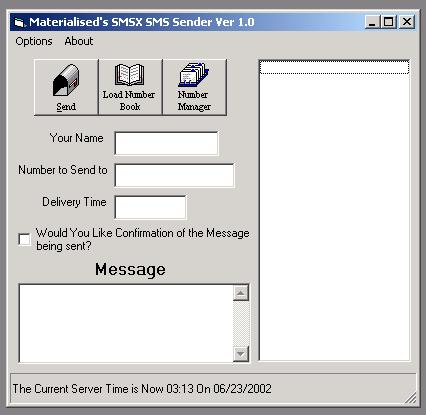



## SMS Sender

### Description

This code sends messages of 160 Characters to SMS Compatable mobile phones. Apparently it supports over 175 countries, however I cant vouch for this as I only tested on british numbers, the program needs you to have a vaild SMSX username and password (Free of Course) and you can sign up from within the program. This program is the basis of a .ocx I am developing to utalise all the xml/soap SMS functions from http://www.soapengine.com/lucin/soapenginex/smsx.asmx If you like this code please vote for it. It isnt very well commented I am afraid as it was only a test for personal reasons. Tip:- If you change the Flash Setting to 1, it will automatically open up on the recipients handset, not giving them the option to read or not.
 
### More Info
 

             |
---                |---
**Submitted On**   |2002-06-23 03:11:46
**By**             |[Materialised](https://github.com/Planet-Source-Code/PSCIndex/blob/master/ByAuthor/materialised.md)
**Level**          |Beginner
**User Rating**    |4.2 (25 globes from 6 users)
**Compatibility**  |VB 3\.0, VB 4\.0 \(16\-bit\), VB 4\.0 \(32\-bit\), VB 5\.0, VB 6\.0
**Category**       |[Internet/ HTML](https://github.com/Planet-Source-Code/PSCIndex/blob/master/ByCategory/internet-html__1-34.md)
**World**          |[Visual Basic](https://github.com/Planet-Source-Code/PSCIndex/blob/master/ByWorld/visual-basic.md)
**Archive File**   |[SMS\_Sender976536222002\.zip](https://github.com/Planet-Source-Code/materialised-sms-sender__1-36168/archive/master.zip)

